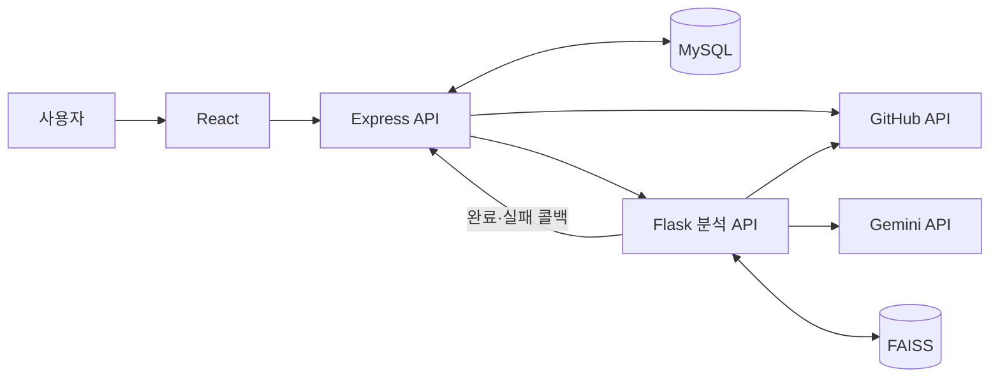

# AIssue

**GitHub 저장소와 이슈를 분석해 오픈소스 기여를 돕는 AI 웹서비스**입니다. 2025년 한국소프트웨어저작권협회(SPC)의 생성형 AI 기반 실용 웹서비스 개발자 양성과정에서 Mai-Nova 팀이 개발했습니다.

프로젝트 기획·개발과 발표는 2025년 4~6월에 진행했으며, 일부 후속 변경은 7월까지 이어졌습니다. 현재 당시 서버와 자동 배포는 사용을 종료했으며, 이 저장소들은 코드·문서·협업 기록을 보존하는 포트폴리오입니다.

## 주요 기능과 구조

- GitHub 로그인, 저장소 탐색·등록·북마크, README 요약
- 저장소 코드 수집·분할, Gemini 임베딩과 FAISS 검색을 이용한 관련 코드 탐색
- 이슈 분석과 해결 제안, 저장소 문서를 문맥으로 활용한 질의응답
- 인덱싱 진행 상태와 완료·실패 처리, 분석 결과 화면

웹 기능은 Express, AI 분석은 Flask에서 처리합니다. 코드 검색 RAG와 문서를 직접 문맥으로 전달하는 질의응답은 별도 경로입니다.

## 저장소와 자료

| 자료 | 내용 |
|---|---|
| [AIssue-BE-Flask](https://github.com/c99-dev/AIssue-BE-Flask) | 코드 인덱싱, 임베딩·검색, AI 분석 API |
| [AIssue-BE-Express](https://github.com/c99-dev/AIssue-BE-Express) | 웹 API, DB, GitHub 및 AI 분석 연동 |
| [AIssue-FE-React](https://github.com/c99-dev/AIssue-FE-React) | 사용자 화면과 분석 결과 표시 |
| [AIssue-Overview](https://github.com/c99-dev/AIssue-Overview) | 프로젝트 안내와 전체 이슈 |
| [AIssue-Meeting-Minutes](https://github.com/c99-dev/AIssue-Meeting-Minutes) | 기획·기술 선택·역할 분담 회의록 |
| [AIssue-Team-Profile](https://github.com/c99-dev/AIssue-Team-Profile) | 팀 소개, 아키텍처·ERD, 원본 발표자료 |

- [프로젝트 보드](https://github.com/users/c99-dev/projects/3)
- [Overview Wiki](https://github.com/c99-dev/AIssue-Overview/wiki) · [Express Wiki](https://github.com/c99-dev/AIssue-BE-Express/wiki)
- [팀 소개와 발표 PDF](https://github.com/c99-dev/AIssue-Team-Profile/blob/main/profile/README.md)
- [시연 영상](https://www.youtube.com/watch?v=ps95XQiVXHI)

## 최성호의 주요 기여

발표자료의 역할 분담과 `c99-dev`가 작성·병합한 PR을 기준으로 정리했습니다.

| 기여 | 확인할 수 있는 변경 |
|---|---|
| Flask RAG·임베딩과 검색 | [Flask #6](https://github.com/c99-dev/AIssue-BE-Flask/pull/6), [#22](https://github.com/c99-dev/AIssue-BE-Flask/pull/22) |
| 인덱싱의 백그라운드 처리와 상태 전달 | [Flask #8](https://github.com/c99-dev/AIssue-BE-Flask/pull/8), [#27](https://github.com/c99-dev/AIssue-BE-Flask/pull/27) |
| Express 저장소·이슈·AI 분석 연동 | [Express #27](https://github.com/c99-dev/AIssue-BE-Express/pull/27), [#41](https://github.com/c99-dev/AIssue-BE-Express/pull/41) |
| GitHub Actions 배포 구성과 React 결과 화면 | [React #11](https://github.com/c99-dev/AIssue-FE-React/pull/11), [#41](https://github.com/c99-dev/AIssue-FE-React/pull/41), [#55](https://github.com/c99-dev/AIssue-FE-React/pull/55) |

인덱싱을 요청 처리와 분리해 진행 상태를 반환한 경험이 주요 설계 사례입니다. 당시 구현은 프로세스 내부 thread를 사용하며, 영속 작업 큐나 프로세스 재시작 이후 작업 복구까지 보장하지는 않습니다.

## 팀과 기록 보존

팀 소개 원본의 참여자는 **최성호(c99-dev), 민유진(gnxm37), 김지은(Pracrobo), 나상현(Soberanalysts)**입니다. 발표자료의 역할 분담에서 민유진은 로그인·JWT 인증·결제, 김지은은 분석 완료 알림·DB ERD 등을 담당했습니다. 팀원들의 역할과 기여 기록은 각 저장소의 commit·PR·회의록에 남아 있습니다.

2026년 9월 8일 Mai-Nova 조직의 저장소 6개를 `c99-dev`로 소유권 이전했습니다. 기존 Git 이력, issue·PR·review와 Wiki를 보존했으며, 문서 저장소 두 개는 찾기 쉬운 이름으로 변경했습니다. 각 저장소의 기존 LICENSE를 따릅니다.
